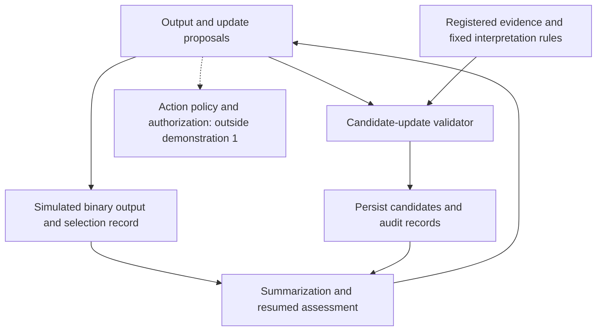

# M-Anchor: Research Structure, Development Plan, and Feasibility

29 September 2026 (Japan Standard Time) · iseyan · Revised edition  
Document type: research and development plan / dated decision memo. This document is separate from the contents and version history of Bundle 1.0.  
[日本語版](https://github.com/iseyan/m-anchor-framework/blob/main/plans/research-roadmap-2026-09-29.ja.md)

This memo records the current position and proposed next steps. The first demonstration has not been carried out; its architecture and completion criteria below are a plan.

**The candidate-preservation principle derived from M-Anchor has a conditional formalization and a minimal reference implementation. The next question is whether a bounded workflow can preserve and use the same distinctions through output, storage, summarization, and resumption.**

Bundle 1.0 contains Formal Note v0.4, Technical Report v0.5, and Python v0.1. During preparation of this memo, their contents and implementation were checked, and all nine bundled tests passed on rerun. This reconfirms the guard's existing unit checks; it is not a new LLM or deployment evaluation. The observation is recorded only in this memo, without amending Verification Report v0.1 or the Bundle's version history.

Rerun record: 2026-09-29 (JST) / CPython 3.12.14, Linux x86_64 / `python3 -m unittest -v` in the Python v0.1 directory extracted from Bundle 1.0 / nine tests passed / implementation SHA-256: `0f9551e8d00cd4408441944d9067cfe9bce7d5653019a5af27738fb5895f58c9` / test-file SHA-256: `1fa228427dfeb4460d2ee14767d64664456f245e505e5d59d4f6ae8b5023db5b`.

The sequence is to prepare a one-page statement of the guarantee's scope, then add a minimal executable example with a version separate from the Bundle. The first demonstration excludes authorization checks and actions in the world. Its primary pass/fail question is whether the resumed process used the preserved distinction. Related sources establish the broad design context; this memo does not establish novelty or priority.

There is a technical basis for proceeding to a bounded demonstration. Commercially, the frequency of the problem in a target workflow, the improvement from integration, the integration cost, and the paying customer remain to be established. These are separate judgments.

M-Anchor can remain the acknowledged origin of the work. An external explanation can first describe the function—producing a required output without deleting candidates on unsupported grounds—and then identify MECC as the M-Anchor-derived preservation condition. This connects the research history to the proposed component's role.

The development of the research can be described through the changing role of each stage.

| Stage | Question addressed | What carries forward |
| --- | --- | --- |
| Initial M-Anchor | Can facts, inferences, speculation, and unknowns remain distinct, with unresolved distinctions preserved? | Avoid unsupported commitment without suppressing supported inference or necessary responses |
| Natural-language runtime instructions | Can short instructions guide a model to follow those principles? | Comparisons of instruction conditions and a way to observe model behavior |
| FC-01 and related comparisons | What happens to an unresolved assessment when A/B is required despite insufficient evidence? | A small example in which binary submission and evidential assessment do not coincide |
| Focus on the boundary | Can distinctions be lost when a downstream component receives only a binary value, even if uncertainty was recognized? | The need to examine record formats and handoffs as well as model responses |
| Formal Note v0.4 | Can candidate removal be constrained by the evidence interpretation applied to the transition? | MECC, the preservation theorem, action and transition records, and measurement definitions |
| Python v0.1 | Can a small external program check the condition? | A 77-line reference implementation and nine tests |
| Next stage | Do checking, persistence, and reuse work within a continuing process? | A bounded demonstration with persistent state and an independent integration evaluation |

Technical Report v0.5 records that, on the insufficient-evidence FC-01 task, the default and generic-caution conditions selected B, while the short instruction permitting an unresolved answer and M-Anchor Minimal left the assessment unresolved without selecting A or B. All conditions selected A on the evidence-sufficient control. Other conversational records also include cases with no additional discrimination between instruction conditions.

This history gives a reason to narrow the research target. Specifying the conditions under which necessary distinctions disappear at output and record boundaries fits the observations better than attempting to establish general reasoning superiority. However, abstaining in FC-01 is different from demonstrating external-state preservation while submitting a binary value. Historical response records are not reinterpreted as results from the new implementation.

Image prototypes have a separate purpose: visual understanding and attracting interest. An image depicting one roof form while a record retains several candidates can explain the difference between making an output concrete and preserving candidates. Visual appeal and clarity have value for that purpose; images need not bear the burden of proving the formal theorem or the guard's effectiveness. Image work is not a required stage of this plan.

**The research structure connects M-Anchor's principles, the bounded condition MECC, an implementation that enforces it, and validation in a target workflow.**

| Layer | Content | Object of assessment |
| --- | --- | --- |
| Principles | Preserve unresolved distinctions without obstructing supported inference or action | Problem formulation and application policy |
| Formal condition | Retain candidates permitted by the applied evidence interpretation | Definitions, assumptions, and proof |
| Runtime enforcement | Reject non-compliant candidate updates before storage | Code, permissions, records, and write paths |
| Workflow effect | Ensure that later processing uses the preserved distinctions | Independent end-to-end evaluation and integration value |

M-Anchor as a whole need not be reduced to MECC. MECC makes one obligation—candidate preservation—checkable. Safety responses, authorization, speculation about internal motives, and probability calibration have other meanings and should not be folded into the same set expression.

The formal core is the following interval.

$$
K_t\cap M(D_t)\subseteq K_{t+1}\subseteq K_t.
$$

| Symbol | Meaning |
| --- | --- |
| $\Omega$ | The candidate space explicitly represented for the process |
| $K_t$ | The currently retained candidate set |
| $D_t$ | Accepted, currently valid evidence applied to this update |
| $M(D_t)$ | Candidates not excluded by the interpretation of that evidence |
| $a_t$ | The output or selected action, recorded separately from the candidate set |

The left inclusion is MECC's preservation condition; the right inclusion is the non-expansion condition defining the ordinary transition scope. When no evidence basis is applied, $M(\varnothing)=\Omega$, so

$$
D_t=\varnothing\implies K_{t+1}=K_t.
$$

The action $a_t$ supplies no grounds to change that equality.

For example, a process can emit $a_B$ while retaining $K_t=\{h_A,h_B\}$. An update that retains only $h_B$ needs an evidence interpretation that permits the removal.

“No evidence basis is applied” does not mean “no new observation has arrived.” Earlier evidence can be used again for computation or inference, provided its basis and procedure are recorded. MECC also does not require every supported exclusion to be incorporated immediately. The full-incorporation rule $K_{t+1}=K_t\cap M(D_t)$ is one endpoint of the interval.

The guarantee concerns an explicit external candidate set. It does not measure or preserve an LLM's hidden representation. Changes to the modeled world or candidate space, evidence retraction, and restoration of mistakenly removed candidates require a correction procedure outside ordinary transitions. An empty set means exhaustion of the represented candidates; it must not be equated with a certain negative or ordinary unresolvedness.

If an external B field means “B is a fact,” preserving uncertainty internally does not supply the evidential grounds for that assertion. Preservation and entitlement to make a public assertion require separate checks.

The following is a proposed architecture for the next stage, not a claim that Python v0.1 already implements every component.

Solid lines show the first demonstration's paths. The dotted action and authorization branch is reserved for later consideration. The first demonstration, which is Stage 2 below, covers simulated outputs and records only. Authorization checks, tool actions in the world, and a policy prohibiting irreversible actions are outside its implementation scope. Policies allowing action under uncertainty or requiring additional checks are separate rules; they do not follow automatically from MECC.

The AI proposes candidate updates. The validator controls writes to the authoritative state. Summaries and plans reference that state instead of reconstructing candidates from a short summary or a past output. Downstream components receive the state or a reliable reference through which they can retrieve it. This separates instructions to the model from actual write authority.

The implementation reviewed for this memo has the following coverage.

| Item | What Python v0.1 provides | What the next demonstration needs |
| --- | --- | --- |
| Candidate set | Stores it as a frozenset | Persistence with process IDs and state versions |
| Candidate removal | Checks a proposed update against MECC | Restriction of authoritative writes to the checked path |
| Update without evidence | Rejects candidate removal | Prevention of output or summary being improperly admitted as evidence |
| Update with evidence | Checks against the supplied compatible set | Controlled evidence registration, acceptance, and interpretation |
| Records | Returns accepted transitions, before/after sets, removals, evidence IDs, and related fields | Records of rejected proposals and joint persistence of state and audit |
| Downstream processing | The caller adopts the returned state | Retrieval of authoritative state on resumption and handoff |
| Isolation | Prevents ordinary mutation through input aliases and similar paths | Protection of the store from code and permissions controlled by the model |
| Verification | Passes the existing nine tests | Checks of restart, failure, and bypass paths in the target process |

This is a small reference implementation requiring neither an API key nor third-party libraries. Its size makes it easier for others to inspect. A frozen data structure is not itself an adversarial security boundary: if the surrounding program allows construction of replacement objects or direct writes, it can create states that never passed the check.

**A central implementation requirement is that the decision to permit candidate removal must itself have an admissible basis.**

For example, if an AI can invent an evidence ID and set compatible to “B only,” the set check can work correctly while the intended protection fails. The present code does not verify the existence, authenticity, acceptance, or validity of evidence IDs, or the correctness of the interpretation procedure. The existing implementation report explicitly states these limits.

The first demonstration should restrict evidence to a small registered set of records and compute exclusions using explicit rules. Model-generated explanations or summaries should not automatically become new observations or independent support. Agreement from a second LLM alone does not establish evidence independence or correctness.

The versions used by the check must remain fixed through the commit. Begin with a single writer; reject updates against stale versions when concurrency is introduced. State and audit records should be saved in one transaction to avoid persisting one without the other.

Even if every state write is checked, the workflow loses the benefit if a later component ignores the saved state and treats an earlier output as a settled finding. Evaluation must cover the next decision that uses the record, not just the contents retained in storage.

Primary sources show that external control of model-driven state and actions already appears in several research and implementation efforts.

| Related source | Main target | Material examined for this memo |
| --- | --- | --- |
| CPEX documentation [4] | Capability calls, authorization, and information-flow control based on state separate from the model | Official design explanation and threat model; no code audit or execution validation |
| CaMeL [5] | Control/data-flow and policy-based protection without modifying the model | Authors' abstract and retrieved design excerpts; no full-paper examination or reproduction |
| SafeAgent [6] | An execution controller and risk reasoning over persistent context | Authors' abstract; no full-paper examination or reproduction |
| Stored Is Not Supported [7] | Provenance, evidential standing of stored material, and checks on releasable assertions | Authors' abstract and retrieved text excerpts; no independent theorem verification or implementation reproduction |
| Neither Layer Alone [8] | Contracts governing epistemic, action, and other commitments across model/harness boundaries | Retrieved authors' abstract; no full-paper examination or implementation validation |

This comparison establishes proximity in broad design and problem formulation. A comparison at the level of preserved objects, transition conditions, evidence acceptance, and output semantics remains a separate task.

A candidate contribution is therefore **an explicit removal-set check requiring preservation of candidates not excluded by the applied evidence interpretation, even under a fixed output interface**.

This is a positioning judgment based on the material examined, not a determination of novelty or priority from an exhaustive literature review. The formal preservation condition, its separation from full incorporation, action and transition records, and runtime checks should be compared with nearby work at the same level of detail.

Existing research and open-source projects provide possible technical points of integration. They do not establish willingness to pay for a M-Anchor-derived component.

The plan retains the current artifacts and defines a bounded target and completion criterion for each stage.

| Stage | Work or deliverable | Completion criterion | Expected responsibility |
| --- | --- | --- | --- |
| 1. State the guarantee's scope | Relate Bundle 1.0 to this plan and prepare a one-page scope statement | A third party can distinguish theory, implementation, observations, and untested claims | Researcher |
| 2. Minimal executable example, demonstration 1 | Add a separately versioned simulated process with finite candidates, registered evidence, one store, and one writer | With the existing candidate-update checks in place, records show that a process resumed after output and summarization used the saved distinction | Feasible on the researcher's side |
| 3. Integration evaluation with a company | Connect one actual workflow and compare it with the existing approach | Establish improvement, integration burden, false rejections, latency, and remaining bypasses in the target environment | Joint work with the integrating company and independent evaluators |
| 4. Consider productization | Develop a common API, adapters, version management, auditing, and maintenance | Identify paying users and a scope within which the guarantee can be maintained | A team including product, infrastructure, and safety expertise |

The first demonstration can use a record-only workflow, such as recording candidate causes in a fault investigation and the selection of a provisional response. It can record “the cause remains A/B unresolved, but response B was selected,” then show that a resumed process reads the authoritative candidate set after summarization and does not treat B as the established cause. Candidate narrowing from registered evidence remains a control for the existing guard.

There is no need to start with many models or industries. Existing response records or fixed proposals can be replayed to demonstrate the persistence mechanism first. One LLM API can then be connected so that actual model-proposed updates pass through the same check. The first activity is a guard demonstration; the second evaluates a connected system. Their results should be recorded separately.

If new model evaluation is added, the aim should not be repetition of the same question. A small set of distinct conditions can cover different failure paths.

| Condition | Intended observation |
| --- | --- |
| Insufficient evidence, required output | An output is produced without unsupported candidate removal |
| Evidence that permits exclusion | Supported updates pass instead of the system merely preserving everything |
| Reapplication of earlier valid evidence | Supported inference or incorporation remains possible without a new observation |
| Outputs, summaries, or invented IDs presented as evidence | Evidence acceptance or update validation rejects the attempt and records it |
| Summarization, restart, and handoff | Later processing retrieves the distinction between candidates and actions and uses it in assessment |

The existing nine tests can be reused for unit conditions such as empty states, out-of-scope candidates, and partial incorporation. Concurrent updates and failure-time persistence should be tested when those capabilities are introduced. Enumerating finite states can help check implementation correspondence; it does not mean that the existing mathematical preservation proof has yet to be formalized.

A comparison can hold evidence acceptance, interpretation, and input fixed while contrasting “store only the output,” “also record distinctions without constraining updates,” and “check updates before storage.” This separates the benefit of adding records from the benefit of enforcing the update condition.

The first demonstration's primary criterion is pass/fail: did the resumed process use the preserved distinction? Its trace should identify the candidate-state version read and the assessment made using that distinction. The mere presence of a saved file or generic uncertainty wording is not success. With the existing candidate-update checks retained, demonstrating this use can satisfy Stage 2's completion criterion.

The first demonstration need not aggregate all three metrics—UECR, SCR, and interface compliance. Later comparisons should use Formal Note v0.4's definitions and state which transitions and denominators are evaluated. UECR for accepted transitions should be reported separately from proposal-side violations, including rejected proposals. Zero UECR after the guard must not be interpreted as model improvement. Rejected proposals and their reasons should be recorded from the first demonstration onward. An SCR evaluation needs an evidence-sufficient control so that retaining every candidate is not mistaken for effective evidence use.

**Feasibility depends on the breadth of the target.**

| Goal | Current assessment | Reason |
| --- | --- | --- |
| Explain and formalize the preservation condition | Artifacts already exist | v0.4 states assumptions, proofs, and limits |
| Check updates to finite candidate sets | A reference implementation already exists | v0.1 and its nine existing tests have been checked |
| Cover persistence and resumption within one workflow | High feasibility as an engineering judgment | No large-scale training is needed; the work can be bounded to persistence, permissions, and records |
| Connect several models to the same state manager | Conditionally feasible | Proposal formats and access to state must be controllable |
| Automatically derive correct candidates and evidence interpretations from arbitrary natural language | Difficult and not solved by the core theorem | Interpretation, candidate completeness, and correction remain separate problems |
| Attach the component to every existing AI system without integration changes | Not supported by the current design | Some environments provide no control over persistence or downstream processing |
| Provide a product or service for a bounded use | Technically a candidate; demand unverified | Improvement value and integration cost matter in addition to implementability |
| Prevent AI incidents generally | Outside this condition's guarantee | Information flow, authorization, execution, and public assertions need additional conditions |

Compared with training a foundation model from scratch, a bounded external-state demonstration is much smaller in scope and required resources. It does not assume GPU fleets or large training datasets. The main work is designing evidence rules, persistence, integration, and verification.

It would still be too broad to say that productionizing an external layer is easier than every form of fine-tuning. Controlling all writes in a complex workflow can be harder than a small fine-tuning task. The approach moves the work into an implementation problem with an inspectable scope. Choosing that scope narrowly supports feasibility.

“Model-independent” should mean that model-weight changes are not a prerequisite. Even if one model can be substituted for another, the integration must accommodate storage, permissions, and downstream behavior. Representing everything an AI knows as one enormous candidate set is not an initial goal. Start with a small candidate set for each bounded assessment.

Commercial development can distinguish research provision, integration evaluation, and operational components.

| Offering | Value delivered | Evidence required at that stage |
| --- | --- | --- |
| Research and joint evaluation | A reproducible problem formulation, condition, and reference implementation | The existing Bundle and a clearly defined evaluation target |
| Paid integration evaluation or demonstration | Identify where a client's workflow loses distinctions and propose a correction | Bounded reproduction and comparison, distinguished from a product-wide guarantee |
| Runtime component, auditing, and maintenance | Continue controlling update paths and checking evidence, versions, and handoffs | Integration validation, failure handling, and ongoing maintenance in the target environment |

External evaluation can be requested using the existing Bundle. The researcher need not validate every model, industry, and deployment condition before presenting the work. The researcher can fix the reproducible core and scope of the guarantee. Paths, frequencies, and costs that can only be assessed inside a company's environment can be examined by that company or its evaluators.

A component sold as preventing invalid state updates must be tested for bypasses within its stated scope. Controlling writes alone does not establish commercial value: evidence interpretation must be appropriate, downstream processing must use the distinctions, and the value must justify integration cost. A bounded evaluation service can be offered before a general product is complete.

This is compatible with publishing the principle and reference implementation. A small public codebase alone is unlikely to sustain exclusive revenue. Continuing value can come from workflow integration, evidence handling, validation, and maintenance as systems change. This is a commercial option, not an observation of established purchasing intent.

Work should begin with Stage 1: a one-page statement of the guarantee's scope. Stage 2 should then be limited to **a minimal executable example that accepts only registered evidence, checks and persists candidate updates, and uses the distinctions after output, summarization, and resumption**. Bundle 1.0 and existing versions remain fixed. The demonstration receives its own version and record. This memo also remains a dated plan outside the Bundle.

That example can show the implementation conditions under which the current mathematics and 77-line reference implementation are useful. Independent evaluation and specific demand from integration partners should guide later decisions about generalization and product scope.

Sources examined:

1. iseyan, Formal Note v0.4, *Epistemic State Preservation under Forced-Choice Interfaces in AI Systems*, 27 September 2026. The text was examined, including the copy in Bundle 1.0.
2. iseyan, Technical Report v0.5, *Preserving Retained Candidate Distinctions in AI Systems*, 27 September 2026. The text was examined. Its distinction between historical response records and the authorization hypothesis is retained here.
3. Bundle 1.0 README, Python v0.1 implementation, bundled tests, and Implementation and Verification Report. The implementation and report were examined and the nine existing tests rerun during preparation of this memo. Earlier discussions were used to trace research decisions, distinguishing review comments and assistant proposals from judgments adopted by the author.
4. CPEX, [Vision](https://contextforge-org.github.io/cpex/docs/vision/) and [Threat Model](https://contextforge-org.github.io/cpex/docs/threat-model/). Accessed 29 September 2026. Scope examined: official design explanation and threat model. No code audit or execution validation.
5. Debenedetti et al., [Defeating Prompt Injections by Design](https://arxiv.org/abs/2503.18813), 2025. Scope examined: authors' abstract and retrieved design excerpts. No full-paper examination or reproduction.
6. Liu et al., [SafeAgent: A Runtime Protection Architecture for Agentic Systems](https://arxiv.org/abs/2604.17562), 2026. Scope examined: authors' abstract. No full-paper examination or reproduction.
7. He and Yu, [Stored Is Not Supported: Typed Provenance and Assertion Guardrails for Persistent AI Agents](https://arxiv.org/abs/2609.02127), 2026. Scope examined: authors' abstract and retrieved text excerpts. No independent theorem verification or implementation reproduction.
8. Shen, [Neither Layer Alone: Epistemic Integrity Requires Hierarchical Joint Design for Long-Running AI Agents](https://arxiv.org/abs/2606.04017), 2026. Scope examined: retrieved authors' abstract. No full-paper examination or implementation validation.

This revision uses Grok's review comments to clarify the rerun's identity, the scope of related-source review, exclusions from the first demonstration, staged measurement, and work order. Review comments are not treated as independent empirical validation. ChatGPT assisted with source comparison, revision, and English translation. Both language editions record the same plan and scope of guarantee.
