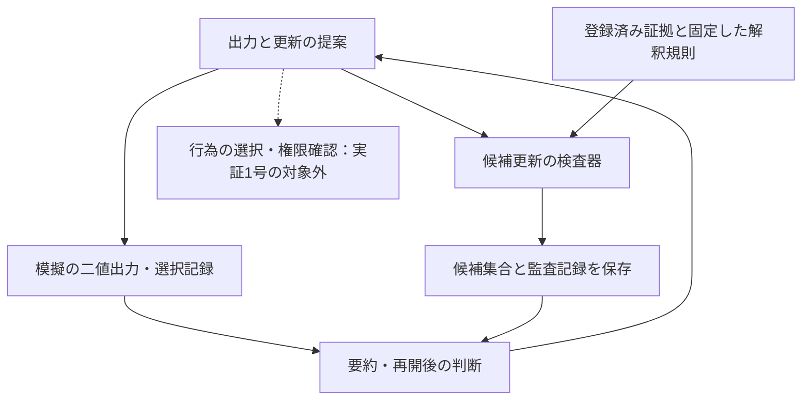

# M-Anchorの研究骨格・開発計画・実現可能性

2026年9月29日（日本時間） · iseyan · 改訂稿  
文書区分：研究・開発計画／日付付き判断メモ。Bundle 1.0の構成物や版履歴には追加しない。  
[English version](https://github.com/iseyan/m-anchor-framework/blob/main/plans/research-roadmap-2026-09-29.en.md)

本メモは、現時点の到達点と今後の工程を記録する。実証1号は未実施であり、以下の実装構成と終了条件は計画である。

**M-Anchorから抽出された候補保存原理は、条件付きの形式化と最小参照実装まで進んでいる。次に確かめるべきことは、限定した処理の中で、出力・保存・要約・再開を通じて同じ区別を保持できるかである。**

現在は、Formal Note v0.4、Technical Report v0.5、Python v0.1をまとめたBundle 1.0がある。本メモの準備時にその内容と実装を確認し、同梱の9テストを再実行して全件通過を確認した。これは既存ガードの単体検査の再確認であり、新たなLLM評価や実運用評価ではない。検証報告v0.1とBundleの版履歴には追記しない。

再実行記録：2026-09-29（JST）／CPython 3.12.14・Linux x86_64／Bundle 1.0から抽出したPython v0.1のディレクトリで `python3 -m unittest -v`／9件通過／本体SHA-256：`0f9551e8d00cd4408441944d9067cfe9bce7d5653019a5af27738fb5895f58c9`／テストSHA-256：`1fa228427dfeb4460d2ee14767d64664456f245e505e5d59d4f6ae8b5023db5b`。

実施順は、まず保証範囲を一枚程度にまとめ、次にBundleとは別版の最小実行例を追加する。実証1号では権限確認や実世界の行為を扱わず、「再開後に保存した区別を使ったか」を主要な可否判定とする。先行資料は設計の大枠を位置づけるために参照しており、新規性や優先権の確定は行っていない。

技術面では、小さな対象に絞った実証へ進む根拠がある。商用面では、対象業務で起きる問題の頻度、導入による改善、導入費用、支払う主体はまだ確かめる必要がある。両者は別の判断である。

M-Anchorという研究上の出自は維持できる。対外説明ではまず「必要な出力を行っても、根拠なく候補を消さない」という機能を示し、その保存条件がM-Anchor由来のMECCであると位置づけると、既存の研究経緯と製品上の役割がつながる。

研究経緯を役割の変化として整理すると、次のようになる。

| 段階 | その段階で扱った問い | 現在の計画へ残るもの |
| --- | --- | --- |
| 当初のM-Anchor | 事実、推論、推測、不明を混同せず、未決の区別を保てるか | 根拠のない確定を避け、成立した推論や必要な対応も抑制しない原則 |
| 自然言語の実行時指示 | 原則をモデルへの短い指示として運用できるか | 指示条件の比較と、モデルの振る舞いを観察する方法 |
| FC-01と関連する比較 | 証拠不足でもA/Bを要求されたとき、未決の評価はどう扱われるか | 二択提出と証拠上の評価が一致しない場合を示す小さな題材 |
| 境界への焦点移動 | 未決と理解していても、下流が二値だけ受け取れば区別が失われるのではないか | モデルの応答だけでなく、記録形式と受け渡しを検討する必要 |
| Formal Note v0.4 | 候補の除去を、適用した証拠解釈で拘束できるか | MECC、保存定理、行為記録と遷移記録、測定指標 |
| Python v0.1 | その条件を小さな外部プログラムで検査できるか | 77行の参照実装と9テスト |
| 次の工程 | 実際の処理の途中で、検査・保存・再利用が成立するか | 永続状態を持つ限定的な実証と、独立した接続評価 |

Technical Report v0.5の記録では、FC-01の証拠不足課題で、標準条件と一般的な注意指示はBを選び、未決を許す短い指示とM-Anchor MinimalはA/Bを選ばず未決を残した。十分な証拠を与えた対照課題では、いずれもAを選んでいる。他の対話課題では追加的な差が見られない記録もある。

この経緯は、研究対象を絞る理由になる。一般的な推論能力の優越を示そうとするより、必要な区別が出力・記録の境界で失われる条件を明示する方が、観察と問題設定が対応する。ただし、FC-01で回答を保留したことは、二値を提出しながら外部状態を保存した実証とは異なる。これまでの応答記録は、新しい実装の動作結果へ読み替えない。

画像の試作には、視覚的な理解や関心を得るという独立した目的がある。一つの屋根形状を描きつつ複数候補を記録に残す例などは、出力の具体化と候補保存の違いを説明できる。絵の魅力やわかりやすさはその目的に対する価値であり、形式定理やガードの効果を証明する負担を画像に課す必要はない。画像試作を本計画の必須工程には置かない。

**研究の骨格は、M-Anchorの原則、MECCという限定した条件、その条件を強制する実装、対象業務での検証を順に対応させることである。**

| 層 | 内容 | 成立を判断する対象 |
| --- | --- | --- |
| 原則 | 未決の区別を根拠なく消さず、正当な推論・行為を妨げない | 問題設定と適用方針 |
| 形式条件 | 適用した証拠解釈が許す候補を保持する | 定義、仮定、証明 |
| 実行時の強制 | 不適合な候補更新を保存前に拒否する | プログラム、権限、記録、保存経路 |
| 業務上の効果 | 後続処理が残された区別を利用する | 独立した処理全体の評価と導入価値 |

M-Anchor全体をMECCに還元する必要はない。MECCは、その中の候補保存という一つの要請を検査可能にしたものである。安全対応、許可、内心の推測、確率の較正など、別の意味を持つ問題を同じ集合式に詰め込まない。

形式上の中心は、次の区間である。

$$
K_t\cap M(D_t)\subseteq K_{t+1}\subseteq K_t.
$$

| 記号 | 意味 |
| --- | --- |
| $\Omega$ | その処理で明示的に扱う候補の範囲 |
| $K_t$ | 現在保持している候補集合 |
| $D_t$ | 今回の更新に適用する、採用済みで有効な証拠 |
| $M(D_t)$ | その証拠の解釈が排除しない候補 |
| $a_t$ | 出力または選択した行為。候補集合とは別の記録 |

左側の包含がMECCの保存条件であり、右側は通常遷移の範囲を定める非拡大条件である。証拠を一切適用しない場合は $M(\varnothing)=\Omega$ なので、

$$
D_t=\varnothing\implies K_{t+1}=K_t
$$

となる。行為 $a_t$ は、この等式を変える根拠にならない。

例えば、$K_t=\{h_A,h_B\}$ のまま、手続上は $a_B$ を出せる。そこから「$h_B$だけを保持する」更新をするには、その除去を認める証拠解釈が必要になる。

ここでいう「証拠を適用しない」は「新しい観測が来ない」と同義ではない。以前の証拠を改めて計算・推論に用いて候補を絞ることは、証拠と手続を記録すれば可能である。またMECCは、証拠が許す除去をすべて直ちに行うことまでは要求しない。全部を反映する規則 $K_{t+1}=K_t\cap M(D_t)$ は、その区間の一端である。

この保証の対象は外部に明示した候補集合である。LLMの内部表現を測定・保存したことにはならない。対象世界や候補範囲が変わる場合、証拠を撤回する場合、誤って消した候補を復元する場合は、通常遷移とは別の訂正手続が必要になる。空集合は候補の尽きた状態であり、「確実な否定」や通常の未決と同一視しない。

さらに、外部のBという欄が「Bは事実である」という意味を持つなら、内部に未決を残しても、その事実認定自体の根拠は補えない。保存できることと、公に断定してよいことはそれぞれ確認する。

実装の構成案は次のとおりである。これは次段階の設計案であり、Python v0.1がすべて備えているという意味ではない。

実線は実証1号で扱う経路であり、点線の行為・権限管理は後続の検討対象である。工程2に当たる実証1号は模擬の出力と記録だけを扱い、権限確認、ツールによる実世界の操作、不可逆行為の禁止方針は実装範囲に含めない。未決でも許される行為や追加確認を要する行為は別の規則で定義するもので、MECCから自動的に導かれるものではない。

AIには候補更新を提案させる。正式な状態の保存権限は検査器側に置く。要約や計画はその状態を参照し、短い要約文や過去の出力から候補集合を勝手に再構成しない。後続処理にも状態を渡すか、確実に読み出せる参照を渡す。この構成により、モデルへの指示と、実際の保存権限を分離できる。

今回確認した実装の到達点は、次のとおりである。

| 項目 | Python v0.1で確認できること | 次の実証で必要になること |
| --- | --- | --- |
| 候補集合 | frozensetとして保持する | 処理ID・状態版を付けて永続化する |
| 候補の除去 | 提案した更新をMECCで検査する | 正式な保存をこの検査経路に限定する |
| 証拠なしの更新 | 候補除去を拒否する | 出力・要約を証拠として誤採用させない |
| 証拠を伴う更新 | 渡されたcompatibleに照らして検査する | 証拠の登録・採用と解釈手続を管理する |
| 記録 | 成功した遷移の前後・除去候補・証拠ID等を返す | 拒否提案も記録し、状態と監査記録を一緒に保存する |
| 後続処理 | 呼び出し側が返された状態を採用する | 再開・引継ぎでも正式な状態を読む |
| 隔離 | 通常の入力別名参照等による変更を防ぐ | モデルが動かせるコードや権限から保存先を保護する |
| 検証 | 既存9テストが通る | 対象処理での再起動、失敗、迂回を確認する |

この実装は、APIキーや外部ライブラリを必要としない小さな参照実装である。その小ささは第三者が検査しやすい利点になる。ただし、frozenなデータ構造は攻撃に耐える権限境界そのものではなく、新しいオブジェクトの作成や直接の保存を周囲のプログラムが許せば検査を通らない状態を作れてしまう。

**実用化で最も注意すべき点は、候補の除去を許す判断も、根拠なく作れてはならないことである。**

例えばAIが、証拠IDを自作し、「この証拠が許す候補はBだけ」とcompatibleを設定できると、集合の検査は正しく動いても目的は達成できない。現在のコードは証拠IDの実在・真正性・採用状態や、解釈手続の正しさを検査していない。これは既存の実装報告にも明示されている。

最初の実証では、証拠を登録済みの少数の記録に限り、どの証拠がどの候補を排除できるかを明示した規則で計算する。AIが生成した説明や要約は、そのまま新しい観測や独立した裏付けとして採用しない。別のLLMに同意させるだけでも、証拠の独立性や正しさは保証されない。

検査の時点と保存の時点で状態や証拠が変わらないよう、使った版を固定する必要もある。単独の書き込み担当から始め、並行処理を導入する段階で古い版への更新を拒否する。状態だけ保存されて記録が残らない、または逆になる失敗を防ぐには、両方を一つのトランザクションで保存する。

すべての状態書き込みを検査しても、後続処理が保存状態を無視して、以前の出力だけから「確定した」と扱えば、業務上の効果は失われる。評価対象には、保存された内容だけでなく、その内容を使う次の判断も含める。

関連する一次資料から見ると、モデルの外で状態・行為を検査する大枠は、すでに複数の研究・実装にある。

| 関連資料 | 主な対象 | 本メモのための確認範囲 |
| --- | --- | --- |
| CPEXの公式資料 [4] | モデルとは分離した状態に基づく、能力呼び出し・認可・情報流の制御 | 公式の設計説明と脅威モデル。コード監査・実行検証は行っていない |
| CaMeL [5] | モデルを変更せず、制御・データの流れと安全方針を使う防御 | 著者概要と取得できた設計説明の抜粋。全文の精査・再現実験は行っていない |
| SafeAgent [6] | 実行を管理する制御器と、継続する文脈に基づくリスク判断 | 著者概要。全文の精査・再現実験は行っていない |
| Stored Is Not Supported [7] | 保存された内容の来歴・証拠上の資格と、公に述べられる内容の検査 | 著者概要と取得できた本文の抜粋。定理の独立検証・実装再現は行っていない |
| Neither Layer Alone [8] | モデルと実行基盤の間で維持すべき認識・行為等の契約 | 取得した著者概要。全文の精査・実装検証は行っていない |

この比較が示すのは、大枠の設計と問題設定の近接性である。保存対象、遷移条件、証拠の採用、出力の意味を同じ単位で照合する比較は別途必要になる。

したがって、独自性候補は「誰も扱っていない第三の安全領域」ではなく、**固定された出力形式の下で、適用した証拠解釈が排除していない候補を保持する条件を、除去集合の検査として明示したこと**に置くのが妥当である。

これは今回の資料に基づく位置づけであり、網羅的な先行研究調査によって新規性や優先権を確定したという意味ではない。形式上の保存条件、完全な証拠反映との分離、行為記録と遷移記録、実装上の検査を、近い研究と同じ単位で比較する必要がある。

先行研究やOSSの存在は、この設計方向に実装上の接点があることを示す。M-Anchor由来の部品に支払需要があることまで示すものではない。

計画は、現在の成果物を維持したうえで、対象と終了条件を限定して進める。

| 工程 | 作るもの・行うこと | 終了条件 | 主な担当の想定 |
| --- | --- | --- | --- |
| 1. 保証範囲の整理 | Bundle 1.0と本計画を対応づけ、保証範囲を一枚程度にまとめる | 理論・実装・観察・未検証事項を第三者が区別できる | 研究者側 |
| 2. 最小実行例（実証1号） | 有限候補、登録済み証拠、保存先一つ、書き込み担当一つで動く模擬処理を、Bundleとは別版で追加する | 既存の候補更新検査を前提に、出力・要約を経て再開した処理が保存済みの区別を使ったことを記録で示す | 研究者側で実施可能 |
| 3. 企業側での接続評価 | 実際の処理一つへ接続し、既存方式と比較する | 改善、導入負担、誤拒否、遅延、残る迂回を実際の環境で確認できる | 接続先企業・独立評価者との共同 |
| 4. 製品化の検討 | 共通API、接続部品、版管理、監査・保守手順を整える | 支払う利用者と利用範囲が定まり、その範囲の保証を継続して維持できる | 製品・基盤・安全性の専門家を含む体制 |

最初の実証は、例えば障害調査の候補と暫定対応の選択を記録するような、実世界の操作を伴わない処理に絞れる。「原因はA/B未決だが、暫定対応Bを選択したという記録を作る」「要約を経て再開した処理が正式な候補集合を読み、Bを確定原因として扱わない」という流れで、保存条件の意味を直接見せられる。登録済みの証拠による候補の絞り込みは、既存ガードの対照条件として確認する。

最初から多数のモデルや多数の業種を扱う必要はない。既存の応答記録や固定した提案を再生して、保存機構の動作を先に示せる。その後、LLM APIを一つ接続して、モデルが実際に出した更新提案を同じ検査に通す。前者はガードの実証、後者は接続したシステムの評価として別に記録する。

工程に新しいモデル評価を加える場合も、同じ問いの反復を増やすことを目的にしない。次の少数の条件で、異なる失敗経路を確認する。

| 条件 | 確認したい結果 |
| --- | --- |
| 証拠不足・出力必須 | 出力は生成でき、候補は根拠なく消えない |
| 候補を排除できる証拠あり | 保存だけを続けず、裏付けのある更新を通す |
| 以前の有効な証拠の再適用 | 新観測がなくても正当な推論・反映を妨げない |
| 出力・要約・架空のIDによる証拠の偽装 | 証拠採用または更新の段階で拒否し、試みを記録する |
| 要約・再起動・引継ぎ | 後続処理が候補と行為の区別を取得し、判断に使う |

空集合、範囲外の候補、部分反映などの単体条件は既存9テストを再利用する。並行更新や障害時の保存は、その機能を導入する段階の検査とする。有限状態を列挙する機械的検査は実装との対応確認に役立つが、既にある紙上の保存証明を「まだ理論化されていない」と扱う理由にはならない。

比較するなら、同じ証拠採用規則・同じ解釈・同じ入力を使い、例えば「出力だけ保存」「区別も記録するが更新を拘束しない」「更新を検査して保存」の差を見る。この比較なら、単なるログの追加による効果と、更新の強制による効果を分けられる。

実証1号の主要な判定は「再開後に保存した区別を使ったか」の可否とする。再開した処理がどの版の候補集合を読み、その区別を使って何を判断したかを、処理記録で追えるようにする。ファイルが残っていることや、一般的な不確実性の文言が出たことだけを成功にしない。既存の候補更新検査を維持し、この利用の可否を示せれば、工程2の終了条件を満たせる。

UECR、SCR、出力形式の遵守の三指標を、実証1号ですべて集計する必要はない。後続の比較評価で測定する場合は、Formal Note v0.4の定義を用い、評価対象の遷移と分母を明示する。ガード通過後の遷移のUECRと、拒否を含む提案側の違反記録を分け、受理遷移だけのゼロをモデルの改善とは解釈しない。拒否した提案と理由は実証1号から記録する。SCRを評価する場合は証拠ありの対照条件を置き、候補を一切消さないことを有効な証拠利用と取り違えない。

**実現可能性は、対象をどこまで広げるかで変わる。**

| 目標 | 現時点の評価 | 理由 |
| --- | --- | --- |
| 保存条件を説明・形式化する | 既に成果物がある | v0.4が仮定・証明・限界まで記述している |
| 有限候補の更新を検査する | 既に参照実装がある | v0.1と既存9テストを確認済み |
| 一つの処理で永続状態と再開まで扱う | 実現性は高いという工学的見立て | 大規模学習を要せず、保存・権限・記録の設計へ限定できる |
| 複数のモデルを同じ状態管理へ接続する | 条件付きで実現可能 | 提案形式と状態へのアクセスを制御できる必要がある |
| 任意の自然言語から、正しい候補と証拠解釈を自動で作る | 難度が高く、核の定理では解決しない | 証拠の解釈・候補の完全性・訂正が別の問題になる |
| あらゆる既存AIへ無変更で付ける | 現状の設計からは約束できない | 状態保存や後続処理を制御できない環境がある |
| 限定用途の製品・サービスにする | 技術的には候補。需要は未確認 | 実装可能性に加え、改善価値と導入費用が判断を左右する |
| AI全般の事故を防ぐ | この条件の保証範囲ではない | 情報流、認可、実行、外部への断定などに別の条件が必要 |

基盤モデルをゼロから学習する仕事と比べれば、限定した外部状態管理の実証は必要資源も範囲も大幅に小さい。GPU群や大規模学習データの調達を前提にしない。主な負担は、証拠規則、状態保存、接続、検査の設計である。

ただし、「外部層の実用化は、どんなfine-tuningよりも容易」とまでは一般化できない。小規模な追加学習より、複雑な業務の全書き込み経路を管理する方が難しい場合もある。ここではモデル学習の難題を、検査可能な範囲の実装問題へ移している。その範囲を小さく選ぶことが実現可能性を支える。

また、モデル非依存は「重みの変更を前提にしない」という意味で捉える。特定のモデルを置換できても、接続先の保存方式・権限・後続処理への対応は必要になる。AIが扱う世界全体を一つの巨大な候補集合にすることも初期目標ではない。判断対象ごとの小さな候補集合から始める。

商用化には、研究成果の提供、接続評価の提供、運用部品の提供という複数の段階がある。

| 提供形態 | 相手へ渡す価値 | その段階で必要な裏付け |
| --- | --- | --- |
| 研究・共同評価 | 再現可能な問題設定、条件、参照実装 | 現在のBundleと明確な評価対象 |
| 有償の接続評価・実証 | 相手の処理のどこで区別が失われるかを確認し、修正案を示す | 対象を限定した再現と比較。製品全体の保証とは区別する |
| 実行時の部品と監査・保守 | 継続して更新経路を管理し、証拠・版・引継ぎを確認できるようにする | 対象環境での統合検査、障害対応、継続保守 |

外部への評価依頼は、既存Bundleの段階で可能である。研究者側ですべてのモデル・業種・実運用条件を検証し終えることを、研究成果を示す前提にはしない。研究者側では、再現できる核と保証範囲を固定する。企業側の環境でしか確かめられない経路・頻度・費用は、接続先や評価者が担う形が合理的である。

一方、状態更新を止める部品として販売するなら、その販売対象の範囲で迂回できないことを検証する必要がある。「すべての書き込みを制御すれば売れる」というだけでは足りず、証拠解釈が適切か、後続処理が区別を使うか、導入価値が費用を上回るかも必要になる。限定した評価サービスであれば、汎用製品が完成する前に提供し得る。

原理と参照実装を公開する方針とは両立する。ただし、小さな公開コードそのものに独占的な収益を期待するのは難しい。継続的な提供価値は、業務への接続、証拠の扱い、検証、更新に伴う保守へ置くのが自然である。これは商用案であり、購入意向を確認済みという判断ではない。

着手順は工程1からとする。まず保証範囲を一枚程度にまとめる。その後、工程2の成果物を**「登録済みの証拠だけを採用し、候補更新を検査して保存し、出力・要約・再開後にも区別を利用できる最小の実行例」**に限定する。Bundle 1.0と既存版は固定した資料として残し、実証を別の版・別の記録として追加する。本メモ自体もBundleには含めず、日付付きの計画として記録する。

その実行例は、新しい広大な理論を掲げずに、現在の数学と77行の参照実装が、どの実装条件の下で役に立つかを見せられる。汎用化する範囲と商品としての範囲は、独立評価と接続先の具体的な需要を受けて決める。

参照した資料は次のとおり。

1. iseyan, Formal Note v0.4, *Epistemic State Preservation under Forced-Choice Interfaces in AI Systems*, 27 September 2026。今回、本文を確認。Bundle 1.0収録版も参照。
2. iseyan, Technical Report v0.5, *Preserving Retained Candidate Distinctions in AI Systems*, 27 September 2026。今回、本文を確認。歴史的な応答記録と認可に関する仮説の区別はこの文書に従った。
3. Bundle 1.0のREADME、Python v0.1本体、同梱テスト、Implementation and Verification Report。本メモの準備時に本体・報告を確認し、既存9テストを再実行した。過去の対話は研究方針の推移を確認する資料として用い、レビューやアシスタントの提案と、著者が採用した判断を区別した。
4. CPEX, [公式説明](https://contextforge-org.github.io/cpex/docs/vision/) および [Threat Model](https://contextforge-org.github.io/cpex/docs/threat-model/)。確認日：2026年9月29日。確認範囲は公式の設計説明と脅威モデル。コード監査・実行検証は行っていない。
5. Debenedetti et al., [Defeating Prompt Injections by Design](https://arxiv.org/abs/2503.18813), 2025。確認範囲は著者概要と取得できた設計説明の抜粋。全文の精査・再現実験は行っていない。
6. Liu et al., [SafeAgent: A Runtime Protection Architecture for Agentic Systems](https://arxiv.org/abs/2604.17562), 2026。確認範囲は著者概要。全文の精査・再現実験は行っていない。
7. He and Yu, [Stored Is Not Supported: Typed Provenance and Assertion Guardrails for Persistent AI Agents](https://arxiv.org/abs/2609.02127), 2026。確認範囲は著者概要と取得できた本文の抜粋。定理の独立検証・実装再現は行っていない。
8. Shen, [Neither Layer Alone: Epistemic Integrity Requires Hierarchical Joint Design for Long-Running AI Agents](https://arxiv.org/abs/2606.04017), 2026。確認範囲は取得した著者概要。全文の精査・実装検証は行っていない。

本改訂はGrokのレビューコメントを参考に、再実行記録の同定、先行資料の確認範囲、実証1号の対象外事項、段階的な測定、着手順を明示した。レビューコメントは独立した実験的検証として扱わない。ChatGPTが資料照合、文章の改訂、英訳を補助した。英日両版は同じ計画と保証範囲を記録する。
